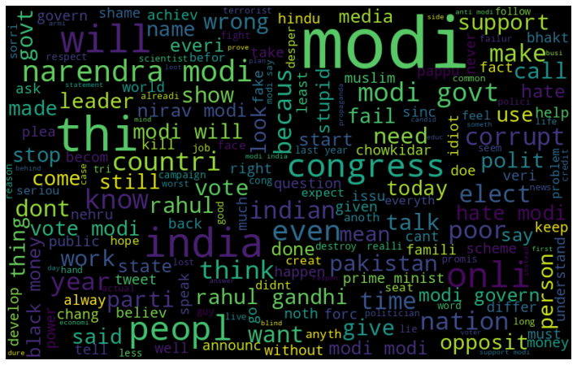
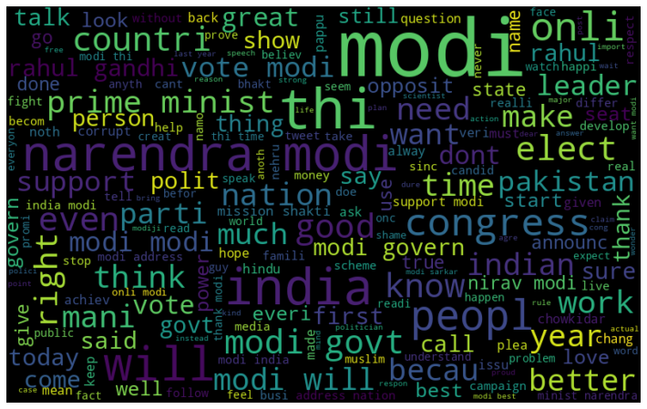
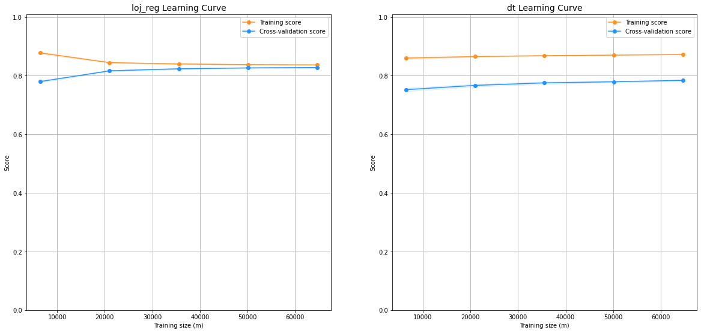

<div style="position: absolute; top: 0; right: 0;">
    <a href="ertugrulbusiness@gmail.com"></a>
    <a href="https://tr.linkedin.com/in/ertu%C4%9Fruldemir?original_referer=https%3A%2F%2Fwww.google.com%2F"></a>
    <a href="https://github.com/ertugruldmr"></a>
    <a href="https://www.kaggle.com/erturuldemir"></a>
    <a href="https://huggingface.co/ErtugrulDemir"></a>
    <a href="https://stackoverflow.com/users/21569249/ertu%c4%9frul-demir?tab=profile"></a>
    <a href="https://medium.com/@ertugrulbusiness"></a>
    <a href="https://www.youtube.com/channel/UCB0_UTu-zbIsoRBHgpsrlsA"></a>
</div>

# Twitter Sentiment Classification
 
## __Table Of Content__
- (A) [__Brief__](#brief)
  - [__Project__](#project)
  - [__Data__](#data)
  - [__Demo__](#demo) -> [Live Demo](https://ertugruldemir-twittersentimentclassification.hf.space)
  - [__Study__](#problemgoal-and-solving-approach) -> [Colab](https://colab.research.google.com/drive/1McC2GEKcd9PWbEs_ywNaTWRApnoAx3EW)
  - [__Results__](#results)
- (B) [__Detailed__](#Details)
  - [__Abstract__](#abstract)
  - [__Explanation of the study__](#explanation-of-the-study)
    - [__(A) Dependencies__](#a-dependencies)
    - [__(B) Dataset__](#b-dataset)
    - [__(C) Modelling__](#c-modelling)
    - [__(D) Deployment as web demo app__](#g-deployment-as-web-demo-app)
  - [__Licance__](#license)
  - [__Connection Links__](#connection-links)

## __Brief__ 

### __Project__ 
- This is a __Classification__ project on text data  with  __machine learning models__. The project uses the  [__Twitter Sentiment Dataset__](https://www.kaggle.com/datasets/saurabhshahane/twitter-sentiment-dataset) to __classify the twits__ into positive and negative class.
- The __goal__ is build a deep learning model that accurately __classify the twits__ into positive and negative class.
- The performance of the model is evaluated using several __metrics__ loss.

#### __Overview__
- This project involves building a deep learning model classify the twits into positive and negative class. The dataset has three sentiments namely, negative(-1), neutral(0), and positive(+1). It contains two fields for the tweet and label.The dataset includes 162.980 twit texts. The models selected according to model tuning results, the progress optimized respectively the previous tune results. The project uses Python and several popular libraries such as Pandas, NumPy.

#### __Demo__

<div align="left">
  <table>
    <tr>
    <td>
        <a target="_blank" href="https://ertugruldemir-twittersentimentclassification.hf.space" height="30">[Demo app] HF Space</a>
      </td>
      <td>
        <a target="_blank" href="https://colab.research.google.com/drive/1rgYTEeWTyNoRAe02hqxt4EOf4bzPhHy9">[Demo app] Run in Colab</a>
      </td>
      <td>
        <a target="_blank" href="https://github.com/ertugruldmr/TwitterSentimentClassification/blob/main/study.ipynb">[Traning pipeline] source on GitHub</a>
      </td>
    <td>
        <a target="_blank" href="https://colab.research.google.com/drive/1McC2GEKcd9PWbEs_ywNaTWRApnoAx3EW">[Traning pipeline] Run in Colab</a>
      </td>
    </tr>
  </table>
</div>


- Description
    -  __classify twits__ into positive and negative class.
    - __Usage__: 
      - Write your twit then clict the button for classify.
- Embedded [Demo](https://ertugruldemir-twittersentimentclassification.hf.space) window from HuggingFace Space
    

<iframe
	src="https://ertugruldemir-twittersentimentclassification.hf.space"
	frameborder="0"
	width="850"
	height="450"
></iframe>

#### __Data__
- The [__Twitter Sentiment Dataset__](https://www.kaggle.com/datasets/saurabhshahane/twitter-sentiment-dataset) from kaggle dataset api.
- The dataset has three sentiments namely, negative(-1), neutral(0), and positive(+1). 
- It contains two fields for the tweet and label.
- The dataset includes 162.980 twit texts.

#### Problem, Goal and Solving approach
- TThis is a __text classification__ problem  that uses the  [__Twitter Sentiment Dataset__](https://www.kaggle.com/datasets/saurabhshahane/twitter-sentiment-dataset)  to __classify the twits__ into positive and negative class.
- The __goal__ is build a deep learning  model that accurately __classify the twits__ into positive and negative class.
- __Solving approach__ is that using the supervised deep learning models.

#### Study
The project aimed classifying the tiwts into positive and negative class. The study includes following chapters.
- __(A) Dependencies__: Installations and imports of the libraries.
- __(B) Dataset__: Downloading and loading the dataset. Preparing the dataset from official website. Configurating the dataset performance and related pre-processes. 
- __(C) Preprocessing__: normalizing the text data, splitting the text data, tokenization, padding, vectorization, configurating the dataset object, batching, performance setting, visualizating, Implementing related processing methods on train dataset and text related processes.
- __(D) Modelling__:
  - Model Architecture
    - linaer, non-linear, ensemble machine learning models are tuned.
  - Training
    - Hyperparams sorted by importance then tumed with GridSearchCV and Cross Validation approachs. The code optimized through greedy search algorithm which assumes the hpyerparams sorted by importance.
  - Saving the model
    - Saved the model as python pickle format.
- __(E) Deployment as web demo app__: Creating Gradio Web app to Demostrate the project.Then Serving the demo via huggingface as live.

#### results
- The final model is __Logistic Regression Classifier__ because of the results and less complexity.
  -  Logistic Regression Classifier
        <table><tr><th>Model Results </th><th></th></tr><tr><td>
      | model    | accuracy | precision | recall   | f1_score |
      |----------|----------|-----------|----------|----------|
      | log_reg  | 0.830846 | 0.830846  | 0.830846 | 0.830846 |
    </td></tr></table>

## Details

### Abstract
- [__Twitter Sentiment Dataset__](https://www.kaggle.com/datasets/saurabhshahane/twitter-sentiment-dataset)   is used to classify twits into positive or negative. The dataset has three sentiments namely, negative(-1), neutral(0), and positive(+1). It contains two fields for the tweet and label.The dataset includes 162.980 twit texts. The models selected according to model tuning results, the progress optimized respectively the previous tune results. The goal is build a deep learning model that accurately classify the twits  using through machine learning algorithms via related training approachs of pretrained state of art models.The study includes creating the environment, getting the data, preprocessing the data, exploring the data, mormalizing the text data, splitting the text data, tokenization, padding, vectorization, configurating the dataset object, batching, performance setting, visualizating, modelling the data, saving the results, deployment as demo app. Training phase of the models implemented through GridSearchCV with Cross Validation. After  Model tuning, selected the basic and more succesful when comparet between other models  is 'logistic regression classifier'. __logistic_regression_classifier__ model  has __0.830846__ accuracy, __0.830846__ precision, __0.830846__  recall, __0.830846__ f1_score other metrics are also found the results section. Created a demo at the demo app section and served on huggingface space.  


### File Structures

- File Structure Tree
```bash
├── demo_app
│   ├── app.py
│   ├── bow_vectorizer.sav
│   ├── loj_reg_twitter_sentiment.sav
│   └── requirements.txt
├── docs
│   └── images
├── env
│   ├── env_installation.md
│   └── requirements.txt
├── LICENSE
├── readme.md
├── study.ipynb
└── Twitter Sentiments.csv
```
- Description of the files
  - demo_app/
    - Includes the demo web app files, it has the all the requirements in the folder so it can serve on anywhere.
  - demo_app/bow_vectorizer.sav:
    - Text Vectorization object using for converting the data into convenient form as numeric vector version.
  - demo_app/loj_reg_twitter_sentiment.sav:
    - Logistic Regression Classifier Sklearn Model Object saved as python pickle format.
  - docs/
    - Includes the documents about results and presentations
  - env/
    - It includes the training environmet related files. these are required when you run the study.ipynb file.
  - LICENSE.txt
    - It is the pure apache 2.0 licence. It isn't edited.
  - readme.md
    - It includes all the explanations about the project
  - study.ipynb
    - It is all the studies about solving the problem which reason of the dataset existance. 
  - requirements.txt
    - It includes the library dependencies of the study.   

### Explanation of the Study
#### __(A) Dependencies__:
  - There is a third-part installation as kaggle dataset api, other requirements hendled by environment, just run the codes form study.ipynb it is enough. You can create an environment via env/requirements.txt. Create a virtual environment then use the following code. It is enough to satisfy the requirements for runing the study.ipynb which training pipeline.
  - Dataset can download from kaggle dataset.
#### __(B) Dataset__: 
  - Downloading the [__Twitter Sentiment Dataset__](https://www.kaggle.com/datasets/saurabhshahane/twitter-sentiment-dataset)  via kaggle dataset api. 
  -  Each word has been put on a separate line and there is an empty line after each sentence.
    - The dataset has three sentiments namely, negative(-1), neutral(0), and positive(+1). 
    - It contains two fields for the tweet and label.
    - The dataset includes 162.980 twit texts.
  - Preparing the dataset via  normalizing the text data, splitting the text data, tokenization, padding, vectorization, stemmization, configurating the dataset object, text preprocessing processes. It is also implemended that Missing value. handling,
     - WordClouds Word Frequencies [ORDERED: Total, Negative, Positive]
        <div style="display:flex; justify-content: center; align-items:center;">
          
          
          
        </div>     


#### __(C) Modelling__: 
  - The processes are below:
    - Model Architecture
      - linear, non-linear, ensemble machine learning classifier models are implemented on this study.
      - The final model has selected as logistic regression because of the performance on classifying binary text classification task.
  - Training
      - Model Tuned via GridSearchCV with Cross Validation approachs.
    - Non-linear models
      - Cross Validation Scores
        | model         | accuracy   | precision  | recall     | f1_score   |
        | -------------|-----------|------------|------------|------------|
        | in_reg        | 0.970404  | 0.970404   | 0.970404   | 0.970404   |
        | l1_reg        | 0.964126  | 0.964126   | 0.964126   | 0.964126   |
        | l2_reg        | 0.980269  | 0.980269   | 0.980269   | 0.980269   |
        | enet_reg      | 0.973094  | 0.973094   | 0.973094   | 0.973094   |
      - Learning Curve
        <div style="display:flex; justify-content: center; align-items:center;">
          
        </div>
     
    - Saving the model
      - Saved the final model which is logistic regression classifier from sklearn library saved as python pickle format.
  - __(E) Deployment as web demo app__: Creating Gradio Web app to Demostrate the project.Then Serving the demo via huggingface as live.

  #### results
  - The final model is __Logistic Regression Classifier__ because of the results and less complexity.
    -  Logistic Regression Classifier
        <table><tr><th>Model Results </th><th></th></tr><tr><td>
      | model    | accuracy | precision | recall   | f1_score |
      |----------|----------|-----------|----------|----------|
      | log_reg  | 0.830846 | 0.830846  | 0.830846 | 0.830846 |
    </td></tr></table>
    - Saving the project and demo studies.
      - trained model __Logistic Regression Classifier__ from sklearn library saved as python pickle format.

#### __(D) Deployment as web demo app__: 
  - Creating Gradio Web app to Demostrate the project.Then Serving the demo via huggingface as live.
  - Desciption
    - Project goal is classifiying twits into positive and negative class.
    - Usage: write your twit for classifictation then use the button to classify.
  - Demo
    - The demo app in the demo_app folder as an individual project. All the requirements and dependencies are in there. You can run it anywhere if you install the requirements.txt.
    - You can find the live demo as huggingface space in this [demo link](https://ertugruldemir-twittersentimentclassification.hf.space) as full web page or you can also us the [embedded demo widget](#demo)  in this document.  
    
## License
- This project is licensed under the Apache 2.0 License. See the [LICENSE](LICENSE) file for details.

<h1 style="text-align: center;">Connection Links</h1>

<div style="text-align: center;">
    <a href="ertugrulbusiness@gmail.com"></a>
    <a href="https://tr.linkedin.com/in/ertu%C4%9Fruldemir?original_referer=https%3A%2F%2Fwww.google.com%2F"></a>
    <a href="https://github.com/ertugruldmr"></a>
    <a href="https://www.kaggle.com/erturuldemir"></a>
    <a href="https://huggingface.co/ErtugrulDemir"></a>
    <a href="https://stackoverflow.com/users/21569249/ertu%c4%9frul-demir?tab=profile"></a>
    <a href="https://www.hackerrank.com/ertugrulbusiness"></a>
    <a href="https://app.patika.dev/ertugruldmr"></a>
    <a href="https://medium.com/@ertugrulbusiness"></a>
    <a href="https://www.youtube.com/channel/UCB0_UTu-zbIsoRBHgpsrlsA"></a>
</div>

